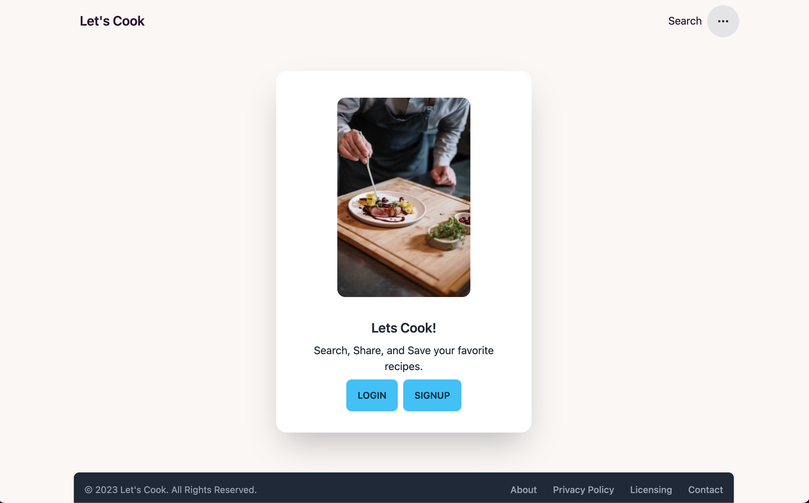
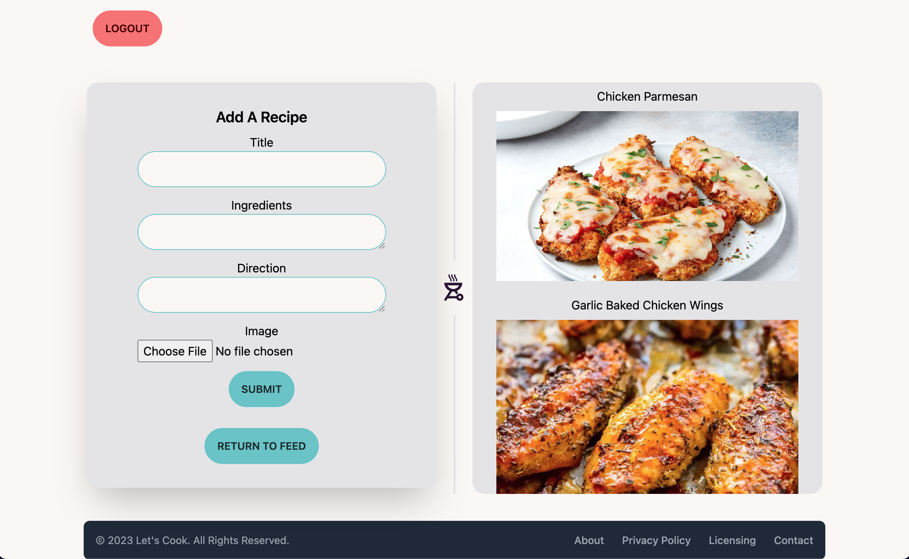
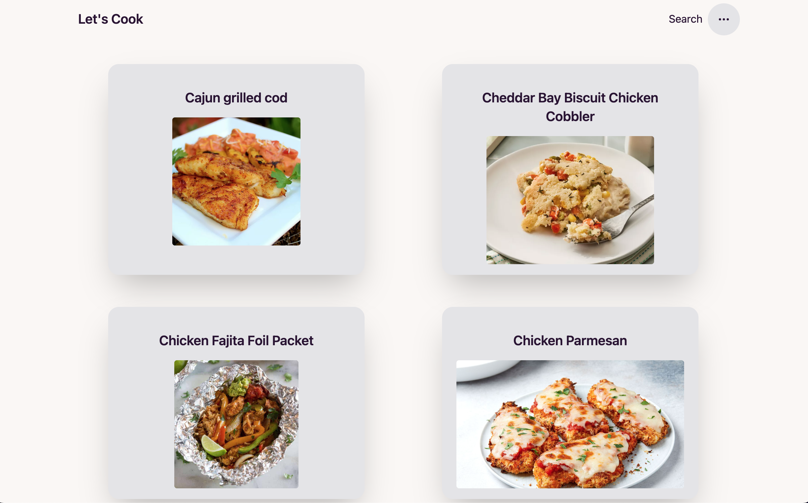
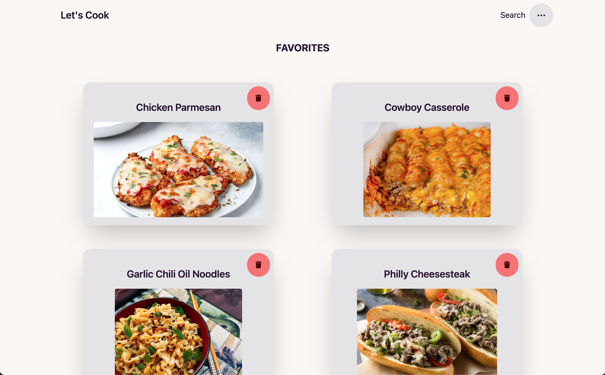

<table bordercolor="#66b2b2">
<tr>
<td width="50%" valign="top">

</td>
<td width="50%" valign="top">

</td>
</tr>
<tr>
<td width="50%" valign="top">

</td>
<td width="50%" valign="top">

</td>
</tr>
</table>
<h1 align="center">Let's Cook</h1>

Take a look at it here 👉 https://letscook.cyclic.app/

<h2 align="center">Tech Used</h2> 

 EJS, CSS3, Tailwind CSS, Javascript, Font Awesome, Node.js, Express, Passport.js, MongoDB, Mongoose, MVC paradigm 

<h2 align="center">Goals and Accomplishments</h2>
Let's Cook is a full-stack web app. I wanted to create a place where users could post their favorite recipes, search for new recipes, and save their favorite recipes to a collection that they could easily find. Users can like, save, and comment on recipes, as well as delete recipes from their favorites that they may not want to keep saved.

<h2 align="center">Optimizations</h2>

Optimized this to fit all screen sizes as best as possible. The goal was for the user to have a fluid experience on all their devices. Designed with mobile-first in mind.

# Install

`npm install`

---

# Things to add

- Create a `.env` file in config folder and add the following as `key = value`
  - PORT = 2121 (can be any port example: 3000)
  - DB_STRING = `your database URI`
  - DB_NAME = `your database name`
  - DB_COLLECTION = `your database collection`
  - CLOUD_NAME = `your cloudinary cloud name`
  - API_KEY = `your cloudinary api key`
  - API_SECRET = `your cloudinary api secret`

---

# Run

`npm start`

# Have fun testing and improving it! 😎

# Lets-Cook-MVP
